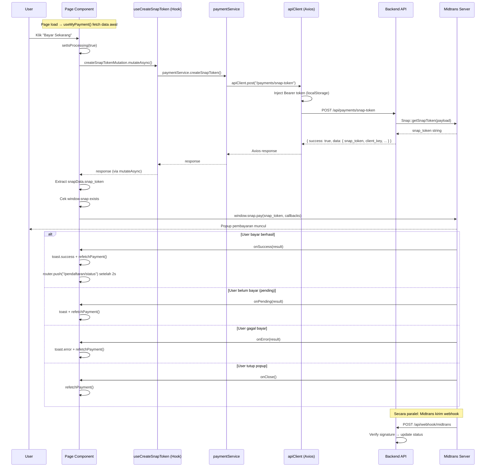

# 📖 Guide: Fetching Pembayaran Midtrans — Best Practice Analysis

> Berdasarkan analisis mendalam terhadap **FE-Pendaftaran** (`src/app/(public)/pendaftaran/pembayaran/page.js`) yang sudah berhasil berjalan sempurna, dokumen ini menjelaskan **pola arsitektur, alur data, dan best practice** yang harus diikuti saat mengimplementasikan fetching Midtrans di **Fe-SIA-UGN**.

---

## Daftar Isi

- [1. Arsitektur Layer (FE-Pendaftaran)](#1-arsitektur-layer-fe-pendaftaran)
- [2. Alur Data Lengkap — Dari Klik hingga Verified](#2-alur-data-lengkap)
- [3. Anatomi Kode: Best Practice per Layer](#3-anatomi-kode-best-practice-per-layer)
  - [3.1 API Client Layer](#31-api-client-layer)
  - [3.2 Service Layer](#32-service-layer)
  - [3.3 Hooks Layer (React Query)](#33-hooks-layer-react-query)
  - [3.4 Page Component Layer](#34-page-component-layer)
- [4. Perbedaan Kritis: FE-Pendaftaran vs Fe-SIA-UGN](#4-perbedaan-kritis)
- [5. Langkah Implementasi untuk Fe-SIA-UGN](#5-langkah-implementasi-untuk-fe-sia-ugn)
- [6. CSP & Next.js Config](#6-csp--nextjs-config)
- [7. Troubleshooting](#7-troubleshooting)

---

## 1. Arsitektur Layer (FE-Pendaftaran)

FE-Pendaftaran menggunakan **4-layer architecture** yang terbukti berhasil:

```
┌──────────────────────────────────────────────────────┐
│  PAGE COMPONENT (pembayaran/page.js)                 │
│  ├── State management (useState)                     │
│  ├── Snap JS loading (next/script)                   │
│  ├── Payment handler (handlePayWithMidtrans)         │
│  └── UI rendering (kondisional per status)           │
├──────────────────────────────────────────────────────┤
│  HOOKS LAYER (hooks/usePayment.js)                   │
│  ├── useMyPayment()     → useQuery                   │
│  └── useCreateSnapToken() → useMutation              │
├──────────────────────────────────────────────────────┤
│  SERVICE LAYER (services/paymentService.js)           │
│  ├── getMyPayment()     → GET /payments/my           │
│  ├── createSnapToken()  → POST /payments/snap-token  │
│  └── checkTransactionStatus() → GET /payments/{id}/check-status │
├──────────────────────────────────────────────────────┤
│  API CLIENT (lib/api.js)                             │
│  ├── Axios instance + baseURL dari env               │
│  ├── Request interceptor → Bearer token              │
│  └── Response interceptor → Error handling           │
└──────────────────────────────────────────────────────┘
```

---

## 2. Alur Data Lengkap

### Sequence Diagram: Dari Klik "Bayar" hingga Verified



### Response Shape dari Backend

**`GET /payments/my`** — Data awal pembayaran:
```json
{
  "success": true,
  "data": {
    "payment": {
      "id": 1,
      "payment_code": "PAYMENT20260001",
      "invoice_number": "INV-2026-05-001",
      "amount": "500000.00",
      "status": "pending",
      "deadline": "2026-05-29T00:00:00.000000Z",
      "applicant_name": "John Doe",
      "registration_number": "REG2026001",
      "paid_at": null,
      "rejection_reason": null
    },
    "available_payment_methods": [...]
  }
}
```

**`POST /payments/snap-token`** — Buat transaksi Midtrans:
```json
{
  "success": true,
  "data": {
    "snap_token": "abc123-def456-ghi789",
    "payment_code": "PAYMENT20260001",
    "invoice_number": "INV-2026-05-001",
    "amount": "500000.00",
    "client_key": "SB-Mid-client-xxxxx"
  }
}
```

---

## 3. Anatomi Kode: Best Practice per Layer

### 3.1 API Client Layer

**File:** `FE-Pendaftaran/src/lib/api.js`

```javascript
import axios from "axios";
import toast from "react-hot-toast";

const apiClient = axios.create({
  baseURL: process.env.NEXT_PUBLIC_API_URL || "http://localhost:8000/api",
  headers: { "Content-Type": "application/json" },
  timeout: 10000,
});

// ✅ Best Practice 1: Auto-inject Bearer token
apiClient.interceptors.request.use((config) => {
  const token = localStorage.getItem("access_token");
  if (token) {
    config.headers.Authorization = `Bearer ${token}`;
  }
  return config;
});

// ✅ Best Practice 2: Global error handling
apiClient.interceptors.response.use(
  (response) => response,
  (error) => {
    if (error.response?.status === 401) {
      // Auto-logout & redirect
      localStorage.removeItem("access_token");
      window.location.href = "/login";
    }
    return Promise.reject(error);
  }
);
```

> **Perbedaan di Fe-SIA-UGN:** Token disimpan di **Cookie** (`js-cookie`), bukan `localStorage`. Jadi `src/lib/axios.js` sudah benar menggunakan `Cookies.get('token')`.

---

### 3.2 Service Layer

**File:** `FE-Pendaftaran/src/services/paymentService.js`

```javascript
import apiClient from "@/lib/api";

export const paymentService = {
  // ✅ BP: Fungsi sederhana, 1 endpoint = 1 fungsi
  getMyPayment: () => apiClient.get("/payments/my"),

  // ✅ BP: Snap token = POST (creates server-side resource)
  createSnapToken: () => apiClient.post("/payments/snap-token"),

  // ✅ BP: Check status = GET (read-only)
  checkTransactionStatus: (paymentId) =>
    apiClient.get(`/payments/${paymentId}/check-status`),
};
```

> **Key insight:** Service layer **tidak melakukan transformasi data**. Hanya wrapper tipis di atas Axios. Semua parsing dilakukan di layer atas.

---

### 3.3 Hooks Layer (React Query)

**File:** `FE-Pendaftaran/src/hooks/usePayment.js`

```javascript
// ✅ BP 1: useQuery untuk data fetching (GET requests)
export const useMyPayment = (enabled = true) => {
  return useQuery({
    queryKey: ["myPayment"],
    queryFn: paymentService.getMyPayment,
    enabled: enabled
      && typeof window !== "undefined"      // SSR guard
      && !!localStorage.getItem("access_token"), // Auth guard
    retry: 1,
    staleTime: 5 * 60 * 1000,      // 5 menit cache
    refetchOnWindowFocus: false,     // Jangan refetch saat focus
  });
};

// ✅ BP 2: useMutation untuk actions (POST requests)
export const useCreateSnapToken = () => {
  return useMutation({
    mutationFn: () => paymentService.createSnapToken(),
    onError: (error) => {
      toast.error(
        error.response?.data?.message || "Gagal membuat transaksi pembayaran"
      );
    },
    // ⚠️ TIDAK ada onSuccess — di-handle di Page component
    // Karena setelah success, kita perlu memanggil window.snap.pay()
  });
};
```

> **Best Practice Penting:**
> - `useCreateSnapToken` **tidak** invalidate queries di `onSuccess` — karena flow berlanjut ke `window.snap.pay()`, bukan selesai.
> - Invalidation (`refetchPayment`) dilakukan di **setiap callback** Snap (success, pending, error, close).

---

### 3.4 Page Component Layer

**File:** `FE-Pendaftaran/src/app/(public)/pendaftaran/pembayaran/page.js`

Ini adalah layer terpenting. Berikut breakdown best practice-nya:

#### A. State Management

```javascript
const [isSnapReady, setIsSnapReady] = useState(false);     // Snap JS loaded?
const [isProcessing, setIsProcessing] = useState(false);    // Sedang proses bayar?
const [snapLoadError, setSnapLoadError] = useState(false);  // Gagal load Snap JS?
const [countdown, setCountdown] = useState("");             // Countdown timer
const [isExpired, setIsExpired] = useState(false);          // Deadline expired?
```

#### B. Snap JS Loading (CRITICAL)

```jsx
<Script
  src="https://app.sandbox.midtrans.com/snap/snap.js"
  data-client-key={
    paymentResponse?.data?.data?.payment?.snap_client_key
    || process.env.NEXT_PUBLIC_MIDTRANS_CLIENT_KEY
    || ""
  }
  strategy="afterInteractive"    // ✅ Load setelah page interactive
  onReady={() => setIsSnapReady(true)}
  onError={() => {
    console.error("Failed to load Midtrans Snap JS");
    setSnapLoadError(true);
  }}
/>
```

> **Best Practice:**
> 1. `strategy="afterInteractive"` — tidak blocking page render
> 2. `data-client-key` — fallback chain: API response → env var → empty
> 3. Track `isSnapReady` dan `snapLoadError` untuk UX yang baik
> 4. **Sandbox URL:** `https://app.sandbox.midtrans.com/snap/snap.js`
> 5. **Production URL:** `https://app.midtrans.com/snap/snap.js`

#### C. Payment Handler (Core Logic)

```javascript
const handlePayWithMidtrans = useCallback(async () => {
  // ✅ Guard: prevent double-click
  if (isProcessing) return;
  setIsProcessing(true);

  try {
    // Step 1: Request snap_token dari backend
    const response = await createSnapTokenMutation.mutateAsync();
    const snapData = response?.data?.data;

    // ✅ Guard: validate snap_token exists
    if (!snapData?.snap_token) {
      toast.error("Gagal mendapatkan token pembayaran");
      setIsProcessing(false);
      return;
    }

    // ✅ Guard: validate Snap JS loaded
    if (!window.snap) {
      toast.error("Midtrans belum siap. Silakan muat ulang halaman.");
      setIsProcessing(false);
      return;
    }

    // Step 2: Open Midtrans popup
    window.snap.pay(snapData.snap_token, {
      onSuccess: function (result) {
        toast.success("Pembayaran berhasil!");
        refetchPayment();  // ✅ Refresh data
        setTimeout(() => router.push("/pendaftaran/status"), 2000);
      },
      onPending: function (result) {
        toast.success("Pembayaran sedang diproses.");
        refetchPayment();  // ✅ Refresh data
      },
      onError: function (result) {
        toast.error("Pembayaran gagal. Silakan coba lagi.");
        refetchPayment();  // ✅ Refresh data
      },
      onClose: function () {
        refetchPayment();  // ✅ PENTING: refresh juga saat close
      },
    });
  } catch (error) {
    toast.error(error.response?.data?.message || "Gagal memproses pembayaran");
  } finally {
    setIsProcessing(false);  // ✅ Always reset processing state
  }
}, [isProcessing, createSnapTokenMutation, refetchPayment, router]);
```

> **7 Best Practice dalam handler ini:**
> 1. **Double-click guard** — `if (isProcessing) return`
> 2. **mutateAsync** — bukan `mutate`, agar bisa `await` dan catch error
> 3. **Validasi snap_token** — sebelum panggil `window.snap.pay`
> 4. **Validasi window.snap** — pastikan Snap JS sudah loaded
> 5. **refetchPayment di SEMUA callback** — termasuk `onClose`
> 6. **Delay redirect** — `setTimeout` 2s agar user lihat toast sukses
> 7. **finally block** — selalu reset `isProcessing`

#### D. Conditional UI berdasarkan Status

```
paymentStatus === "pending"                → Tampilkan form bayar + tombol
paymentStatus === "rejected"               → Tampilkan form bayar + alasan reject
paymentStatus === "waiting_verification"   → Tampilkan detail + badge "Menunggu"
paymentStatus === "verified"               → Tampilkan detail + badge "Terverifikasi"
```

#### E. Button Disable Logic

```jsx
<Button
  onClick={handlePayWithMidtrans}
  disabled={isProcessing || isExpired || snapLoadError}
>
```

3 kondisi disable:
- `isProcessing` — sedang memproses pembayaran
- `isExpired` — deadline sudah lewat
- `snapLoadError` — Snap JS gagal dimuat

---

## 4. Perbedaan Kritis

### FE-Pendaftaran vs Fe-SIA-UGN

| Aspek | FE-Pendaftaran | Fe-SIA-UGN |
|-------|---------------|------------|
| **Token storage** | `localStorage.getItem("access_token")` | `Cookies.get('token')` (js-cookie) |
| **Axios instance** | `src/lib/api.js` | `src/lib/axios.js` |
| **Toast library** | `react-hot-toast` | `sonner` |
| **Auth check** | `!!localStorage.getItem("access_token")` | `!!Cookies.get('token')` |
| **Service pattern** | Object literal (`paymentService.xxx`) | Named exports (`fetchXxx`, `submitXxx`) |
| **Data validation** | None (raw Axios response) | **Zod schemas** (type-safe) |
| **Backend API** | `POST /payments/snap-token` | `POST /student/tuition/{id}/checkout` |
| **Backend response** | `{ success, data: { snap_token } }` | `{ status, data: { snap_token } }` |

### Mapping Endpoint

| FE-Pendaftaran | Fe-SIA-UGN Backend |
|---------------|-------------------|
| `GET /payments/my` | `GET /student/tuition` + `GET /student/tuition/{id}` |
| `POST /payments/snap-token` | `POST /student/tuition/{id}/checkout` |
| `GET /payments/{id}/check-status` | `GET /student/tuition/{id}/payment-status` |

---

## 5. Langkah Implementasi untuk Fe-SIA-UGN

### Step 1: Environment Variables

Tambahkan di `.env`:

```env
# Midtrans Client Key
NEXT_PUBLIC_MIDTRANS_CLIENT_KEY=SB-Mid-client-xxxxxxxxxxxxx

# Snap JS URL (sandbox)
NEXT_PUBLIC_MIDTRANS_SNAP_URL=https://app.sandbox.midtrans.com/snap/snap.js
```

### Step 2: CSP Config di `next.config.mjs`

Midtrans Snap butuh akses ke domain Midtrans. Tambahkan ke `frame-src`:

```javascript
// next.config.mjs
async headers() {
  return [
    {
      source: "/:path*",
      headers: [
        {
          key: "Content-Security-Policy",
          value: [
            "frame-src 'self' https://app.sandbox.midtrans.com https://app.midtrans.com",
            "script-src 'self' 'unsafe-inline' 'unsafe-eval' https://app.sandbox.midtrans.com https://app.midtrans.com",
          ].join("; "),
        },
      ],
    },
  ];
},
```

### Step 3: Service Layer (Sudah Ada)

Fe-SIA-UGN sudah punya di `src/features/ukt/services/tuitionService.ts`:

```typescript
// ✅ Sudah ada — checkout (buat snap_token)
export async function checkoutStudentTuition(tuitionFeeId: number, bank: string) { ... }

// ✅ Sudah ada — cek status Midtrans
export async function fetchStudentPaymentStatus(tuitionFeeId: number) { ... }
```

### Step 4: Buat React Query Hook

**File baru:** `src/lib/react-query/hooks/useMidtransPayment.js`

```javascript
import { useMutation, useQuery, useQueryClient } from '@tanstack/react-query';
import {
  checkoutStudentTuition,
  fetchStudentPaymentStatus,
} from '@/features/ukt/services/tuitionService';
import { toast } from 'sonner';

/**
 * Hook checkout UKT via Midtrans.
 * Pattern: useMutation (karena POST, creates resource)
 * TIDAK ada onSuccess invalidation — flow berlanjut ke window.snap.pay()
 */
export const useCheckoutTuition = () => {
  return useMutation({
    mutationFn: ({ tuitionFeeId, bank }) =>
      checkoutStudentTuition(tuitionFeeId, bank),
    onError: (error) => {
      toast.error(error.message || 'Gagal membuat transaksi pembayaran.');
    },
  });
};

/**
 * Hook cek status pembayaran Midtrans (polling).
 * Pattern: useQuery dengan refetchInterval untuk auto-poll.
 */
export const usePaymentStatus = (tuitionFeeId, { enabled = false, refetchInterval = false } = {}) => {
  return useQuery({
    queryKey: ['paymentStatus', tuitionFeeId],
    queryFn: () => fetchStudentPaymentStatus(tuitionFeeId),
    enabled: enabled && !!tuitionFeeId,
    refetchInterval,
    retry: 2,
    staleTime: 10_000,
  });
};
```

### Step 5: Update Halaman Pembayaran

Update `src/app/ukt/bayar/page.js` — ganti dummy data dengan implementasi real. Berikut pola yang harus diikuti (sesuai best practice FE-Pendaftaran):

```jsx
'use client';

import { useState, useCallback } from 'react';
import { useRouter } from 'next/navigation';
import Script from 'next/script';
import { toast } from 'sonner';
import { useCheckoutTuition } from '@/lib/react-query/hooks/useMidtransPayment';

export default function UktPaymentPage() {
  const router = useRouter();
  const checkoutMutation = useCheckoutTuition();

  // ✅ State management (sama persis dengan FE-Pendaftaran)
  const [isSnapReady, setIsSnapReady] = useState(false);
  const [isProcessing, setIsProcessing] = useState(false);
  const [snapLoadError, setSnapLoadError] = useState(false);

  // Data tagihan dari halaman sebelumnya (via query params / context)
  const tuitionFeeId = /* dari route params atau state */;
  const selectedBank = 'bni';

  // ✅ Handler: Pattern identik dengan FE-Pendaftaran
  const handlePayWithMidtrans = useCallback(async () => {
    if (isProcessing) return;
    setIsProcessing(true);

    try {
      // Step 1: Checkout → dapatkan snap_token
      const result = await checkoutMutation.mutateAsync({
        tuitionFeeId,
        bank: selectedBank,
      });

      const snapToken = result.transaction?.snap_token;
      if (!snapToken) {
        toast.error('Gagal mendapatkan token pembayaran.');
        setIsProcessing(false);
        return;
      }

      if (!window.snap) {
        toast.error('Midtrans belum siap. Silakan muat ulang halaman.');
        setIsProcessing(false);
        return;
      }

      // Step 2: Open Midtrans popup
      window.snap.pay(snapToken, {
        onSuccess: (result) => {
          toast.success('Pembayaran berhasil!');
          setTimeout(() => router.push('/ukt/success'), 2000);
        },
        onPending: (result) => {
          toast.info('Pembayaran sedang diproses.');
          // Opsional: redirect ke halaman waiting
        },
        onError: (result) => {
          toast.error('Pembayaran gagal. Silakan coba lagi.');
        },
        onClose: () => {
          // User menutup popup tanpa bayar
          console.log('Popup closed');
        },
      });
    } catch (error) {
      toast.error(error.message || 'Gagal memproses pembayaran.');
    } finally {
      setIsProcessing(false);
    }
  }, [isProcessing, checkoutMutation, tuitionFeeId, selectedBank, router]);

  return (
    <div>
      {/* ✅ Load Midtrans Snap JS */}
      <Script
        src={process.env.NEXT_PUBLIC_MIDTRANS_SNAP_URL
          || "https://app.sandbox.midtrans.com/snap/snap.js"}
        data-client-key={process.env.NEXT_PUBLIC_MIDTRANS_CLIENT_KEY || ""}
        strategy="afterInteractive"
        onReady={() => setIsSnapReady(true)}
        onError={() => setSnapLoadError(true)}
      />

      {/* ✅ Tombol Bayar dengan 3 guard conditions */}
      <button
        onClick={handlePayWithMidtrans}
        disabled={isProcessing || snapLoadError || !isSnapReady}
      >
        {isProcessing ? 'Memproses...' : 'Bayar Sekarang'}
      </button>
    </div>
  );
}
```

---

## 6. CSP & Next.js Config

### Content Security Policy

Midtrans Snap membutuhkan akses untuk:
- **Script:** Load `snap.js` dari domain Midtrans
- **Frame:** Menampilkan popup/iframe pembayaran
- **Connect:** API calls ke Midtrans server

Jika Fe-SIA-UGN punya CSP headers di `next.config.mjs`, tambahkan domain Midtrans:

```
frame-src: https://app.sandbox.midtrans.com https://app.midtrans.com
script-src: https://app.sandbox.midtrans.com https://app.midtrans.com
```

### CORS

Backend harus mengizinkan CORS dari domain frontend. Ini sudah di-handle di **backend**, bukan frontend.

---

## 7. Troubleshooting

### Problem: `window.snap is undefined`

**Penyebab:** Snap JS belum selesai di-load saat user klik tombol bayar.

**Solusi:**
```javascript
// Cek isSnapReady sebelum enable tombol
<button disabled={!isSnapReady || isProcessing}>Bayar</button>
```

### Problem: Snap popup tidak muncul / blocked

**Penyebab:** Content Security Policy memblokir iframe Midtrans.

**Solusi:** Tambahkan domain Midtrans ke CSP header (lihat Section 6).

### Problem: `snap_token` kosong / undefined

**Penyebab:** Backend gagal generate token (server key salah, atau tagihan sudah dibayar).

**Solusi:**
```javascript
if (!snapData?.snap_token) {
  toast.error("Gagal mendapatkan token pembayaran");
  return; // Jangan lanjut ke window.snap.pay()
}
```

### Problem: Status tidak terupdate setelah bayar

**Penyebab:** Webhook dari Midtrans belum masuk ke backend (jika lokal, perlu ngrok).

**Solusi:**
1. Untuk **lokal development**: Gunakan ngrok agar Midtrans bisa kirim webhook
2. Untuk **production**: Pastikan URL webhook terdaftar di dashboard Midtrans
3. Gunakan **polling** sebagai fallback:
```javascript
const { data } = usePaymentStatus(tuitionFeeId, {
  enabled: true,
  refetchInterval: 5000, // Poll setiap 5 detik
});
```

### Problem: Token expired / stale

**Penyebab:** Snap token punya masa berlaku terbatas (biasanya 24 jam).

**Solusi:** Selalu request **snap_token baru** setiap kali user klik "Bayar". Jangan cache/reuse token lama.

---

## Checklist Implementasi

- [ ] Tambahkan env vars `NEXT_PUBLIC_MIDTRANS_CLIENT_KEY` dan `NEXT_PUBLIC_MIDTRANS_SNAP_URL`
- [ ] Update CSP di `next.config.mjs` jika ada
- [ ] Buat hook `useMidtransPayment.js` (Section 5 Step 4)
- [ ] Update `src/app/ukt/bayar/page.js` — ganti dummy data (Section 5 Step 5)
- [ ] Load Snap JS via `next/script` dengan `strategy="afterInteractive"`
- [ ] Implementasi handler `handlePayWithMidtrans` dengan 3 guards
- [ ] Handle semua 4 callback: `onSuccess`, `onPending`, `onError`, `onClose`
- [ ] Test dengan Midtrans Sandbox (kartu test: `4811 1111 1111 1114`)
- [ ] Verifikasi webhook berjalan (atau setup polling sebagai fallback)
